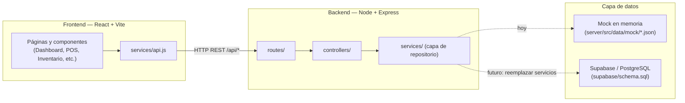

# 🩺 Botica Nova Salud

Sistema web de gestión de inventario, ventas y atención al cliente para una botica (farmacia) en Perú. Incluye control de stock, punto de venta (POS), historial de ventas, alertas de reposición y vencimiento, gestión de clientes, reportes y panel de administración.

Interfaz 100% en español · Moneda en soles (S/) · IGV 18%.

---

## Stack tecnológico

| Capa | Tecnología |
|---|---|
| Frontend | React 18 + Vite, TailwindCSS 4, React Router DOM, lucide-react, recharts |
| Backend | Node.js + Express (API REST) |
| Datos | Mock en memoria (JSON), con capa de servicios lista para migrar a Supabase |
| Base de datos futura | PostgreSQL vía Supabase (`supabase/schema.sql`) |

El backend **no está conectado a ninguna base de datos real todavía**. Los datos viven en `server/src/data/mock/*.json` y se cargan en memoria al iniciar el servidor. La capa `server/src/services/` actúa como repositorio: para migrar a Supabase solo se reescriben esos archivos (sin tocar controladores ni frontend).

---

## Estructura del proyecto

```
botica-nova-salud/
├── client/                  → React + Vite + Tailwind
│   └── src/
│       ├── components/      → Componentes reutilizables (Sidebar, Header, Modal, etc.)
│       ├── pages/           → Módulos: Login, Dashboard, Inventario, POS, Ventas, Alertas, Clientes, Reportes, Admin
│       ├── services/api.js  → Cliente HTTP hacia la API REST
│       ├── context/         → AuthContext (sesión) y ToastContext (notificaciones)
│       └── hooks/           → Hooks reutilizables (useAlertas)
├── server/                  → Node + Express
│   └── src/
│       ├── routes/          → Definición de endpoints REST
│       ├── controllers/     → Manejo de requests/responses
│       ├── services/        → Capa de repositorio (swap point para Supabase)
│       └── data/mock/       → Datos semilla en JSON
├── supabase/schema.sql      → Esquema PostgreSQL listo para ejecutar en Supabase
└── README.md
```

---

## Instalación paso a paso

### 1. Requisitos previos
- Node.js 18 o superior
- npm 9 o superior

### 2. Instalar dependencias

Desde la raíz del proyecto:

```bash
npm run install:all
```

Esto instala las dependencias de la raíz, del `client/` y del `server/`.

> Alternativa manual:
> ```bash
> cd server && npm install
> cd ../client && npm install
> ```

### 3. Levantar el proyecto

Desde la raíz (levanta cliente y servidor a la vez):

```bash
npm run dev
```

- **API**: http://localhost:4000
- **Frontend**: http://localhost:5173 (Vite hace proxy de `/api` hacia el backend)

O por separado:

```bash
npm run dev:server   # solo backend
npm run dev:client   # solo frontend
```

### 4. Iniciar sesión

| Rol | Correo | Contraseña |
|---|---|---|
| Administrador | admin@novasalud.com | admin123 |
| Vendedor | vendedor@novasalud.com | vende123 |

El **Administrador** ve todos los módulos. El **Vendedor** solo ve: Dashboard, Punto de Venta, Inventario (solo lectura) y Clientes — el acceso a los demás módulos está bloqueado incluso navegando directamente por URL.

---

## Endpoints de la API

Base URL: `/api`

| Método | Endpoint | Descripción |
|---|---|---|
| POST | `/auth/login` | Autenticación (simulada, lista para Supabase Auth) |
| GET | `/productos` | Listar productos |
| GET | `/productos/:id` | Obtener producto por id |
| POST | `/productos` | Crear producto |
| PUT | `/productos/:id` | Actualizar producto |
| DELETE | `/productos/:id` | Eliminar producto |
| GET | `/categorias` | Listar categorías |
| POST | `/categorias` | Crear categoría |
| PUT | `/categorias/:id` | Actualizar categoría |
| DELETE | `/categorias/:id` | Eliminar categoría |
| GET | `/ventas` | Listar ventas (`?desde=&hasta=&metodoPago=`) |
| GET | `/ventas/:id` | Detalle de una venta |
| POST | `/ventas` | Registrar una venta (descuenta stock) |
| GET | `/clientes` | Listar clientes |
| GET | `/clientes/:id` | Detalle de cliente + historial de compras |
| POST | `/clientes` | Crear cliente |
| PUT | `/clientes/:id` | Actualizar cliente |
| DELETE | `/clientes/:id` | Eliminar cliente |
| GET | `/alertas` | Alertas activas de stock bajo y vencimiento |
| GET | `/dashboard/resumen` | KPIs y datos para el Dashboard |
| GET | `/reportes/ventas` | Ventas por rango (`?desde=&hasta=`) |
| GET | `/reportes/productos-mas-vendidos` | Ranking de productos vendidos |
| GET | `/reportes/valor-inventario` | Valor total del inventario |
| GET/POST/PUT/DELETE | `/usuarios` | Gestión de usuarios (mock, panel de administración) |

---

## Arquitectura



Cuando se quiera conectar Supabase, basta con reescribir cada archivo de `server/src/services/*.js` para que use el cliente de Supabase en lugar del repositorio en memoria — los controladores, rutas y el frontend permanecen intactos. El esquema de tablas ya está listo en [`supabase/schema.sql`](supabase/schema.sql).

---

## Datos de ejemplo precargados

- 20 productos reales de botica peruana (Paracetamol, Ibuprofeno, Amoxicilina, Panadol, etc.), con 3 productos en stock bajo y 2 agotados para probar las alertas.
- 10 categorías de productos.
- 5 clientes.
- 10 ventas históricas distribuidas en los últimos 7 días (para poblar el Dashboard).

---

## Despliegue en Vercel

El proyecto ya incluye la configuración necesaria ([vercel.json](vercel.json) y [api/index.js](api/index.js)):

- El **frontend** se compila con Vite y se sirve como sitio estático desde `client/dist`.
- El **backend Express** se empaqueta como una función serverless (`api/index.js`), invocada para toda ruta `/api/*`.
- Las rutas del SPA (`/dashboard`, `/pos`, etc.) tienen fallback a `index.html`, así que no dan 404 al recargar.

### Pasos

**Opción A — desde GitHub:**
1. Sube el proyecto a un repositorio.
2. En Vercel: **Add New → Project** e importa el repositorio.
3. Si `botica-nova-salud` NO es la raíz del repositorio, configura **Root Directory** apuntando a la carpeta `botica-nova-salud` (Settings → General → Root Directory). Este paso es la causa más común del error `404: NOT_FOUND`.
4. No cambies nada más: `vercel.json` ya define el build (`npm run build`), la salida (`client/dist`) y los rewrites. Haz clic en **Deploy**.

**Opción B — con la CLI:**
```bash
cd botica-nova-salud
npx vercel        # despliegue de prueba (preview)
npx vercel --prod # despliegue a producción
```

### Limitación importante (datos mock)

Los datos viven **en memoria** dentro de la función serverless. En Vercel cada instancia es efímera: las ventas, productos o clientes que crees se perderán cuando la función se recicle (cold start), y los datos vuelven a los JSON semilla. Es el comportamiento esperado para una **prueba/demo**. Para persistencia real, conecta Supabase reemplazando la capa `server/src/services/` (el esquema ya está en `supabase/schema.sql`).

---

## Notas sobre seguridad

La autenticación actual es **simulada** con contraseñas en texto plano en datos mock, solo para fines de demostración. Antes de llevar este proyecto a producción:
- Migrar a Supabase Auth (o similar) con hashing de contraseñas.
- Habilitar las políticas de Row Level Security ya definidas en `supabase/schema.sql`.
- Servir la aplicación sobre HTTPS y mover cualquier secreto a variables de entorno.
